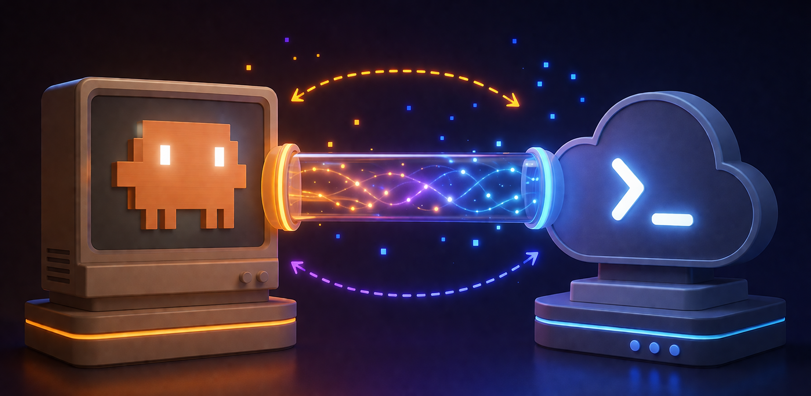

<div align="center">



# Agent OS

### **Install once. Hand off forever. Never leak a secret again.**

**The drop-in template that lets Claude, Codex, Cursor, and any AI assistant safely share a codebase — without losing context, leaking secrets, or stepping on each other.**

[](https://github.com/munsanco13/agent-os/releases)
[](LICENSE)
[](https://github.com/munsanco13/agent-os/stargazers)
[](https://github.com/munsanco13/agent-os/issues)
[](CONTRIBUTING.md)

[**Install in 5 minutes →**](#-install-paste-this-into-your-ai)
&nbsp;·&nbsp;
[**Why this exists**](#the-problem-this-solves)
&nbsp;·&nbsp;
[**See it vs alternatives**](#how-agent-os-compares)
&nbsp;·&nbsp;
[**Read the playbook**](PLAYBOOK.md)

</div>

---

## The problem this solves

You're using **multiple AI assistants** to ship software in 2026:
Claude Code at home. Codex on your work laptop. Cursor when pair-programming. Sometimes Aider in the terminal.

It's chaos, and you know it:

- 🤯 **Every new session starts cold.** You re-paste context, re-explain conventions, re-litigate decisions you already made last week.
- 🔥 **You almost leaked a secret.** Maybe last Tuesday with that `.env` you nearly committed. Maybe a service-role key your AI suggested putting in `config.ts`.
- 🪦 **Your `main` branch is unprotected.** You meant to set up branch protection. You haven't. Anyone with push access can `--no-verify` past anything.
- 📦 **Each AI tool reads a different config file.** Claude wants `CLAUDE.md`. Cursor wants `.cursorrules`. Codex wants `AGENTS.md`. Cline wants `.clinerules`. You either maintain 5 duplicate files or accept that 4 AIs ignore your rules.
- 🌪 **Switching machines means losing your place.** Your laptop has the env vars, the IDE state, the dev server running. The other device has nothing.
- 🤝 **Handing off to a new AI is a 30-minute brain dump.** "Here's what we did. Here's why. Here's what's next. Don't touch X. Watch out for Y..."

**Most "AI workflow" tools solve one of these. Agent OS solves all of them in a single 5-minute install.**

---

## What Agent OS gives you

A protected, AI-friendly project where any agent can pick up where the last one left off — without you re-onboarding them every time.

### Value Stack (what's actually inside)

Each item below is something you would otherwise spend hours building yourself, or skip entirely:

| ✅ Capability | What it replaces | Hours saved (est.) |
|---|---|---:|
| **Auto-detected stack config** for Node/Python/Rust/Go/Ruby/PHP/Elixir/Java/Deno + 15+ frameworks | Manually documenting build/test/lint commands | ~2h |
| **Single source-of-truth `AGENTS.md`** with symlinks to `CLAUDE.md`, `.cursorrules`, `.clinerules`, `.continuerules`, `CONVENTIONS.md` | Maintaining 5+ duplicate config files | ~3h |
| **Server-side secret scanning** (gitleaks Action) on every push and PR | Building/configuring a secret scanner | ~4h |
| **Local pre-commit / commit-msg / pre-push hooks** with gitleaks + Conventional Commits + force-push refusal | Writing 3 hooks from scratch | ~4h |
| **GitHub Actions workflows**: secret-scan, large-files, no-direct-pushes, hooks-integrity, placeholder-lint, pr-title, pr-body | Designing + writing 4 CI workflows | ~8h |
| **Branch protection automation via `gh api`** | Clicking 12 boxes in GitHub Settings | ~30 min (repeated for every project) |
| **Weekly branch-protection drift audit** | Manual quarterly checks | ~ongoing |
| **ADR (Architecture Decision Records) scaffold** | Setting up + maintaining a decisions log | ~2h |
| **Per-session work logs** (replaces flaky `HANDOFF.md` merge conflicts) | Custom changelog discipline | ~ongoing |
| **Cross-platform support** (Mac/Linux/WSL/Git Bash) via `.gitattributes` + exec-bit-in-git | Debugging Windows line-ending issues | ~4h |
| **CODEOWNERS, PR template, Dependabot, vulnerability disclosure** | Boilerplate every repo eventually needs | ~2h |
| **Threat-modeled `SECURITY.md`** with explicit defended/not-defended scope | Pretending you have a threat model | ~3h |
| **`import.sh` to ingest legacy CLAUDE.md / .cursorrules / etc. into AGENTS.md** | Manually merging duplicate AI configs | ~1h |
| **`validate.sh`, `update.sh`, `uninstall.sh`** for lifecycle management | Hand-rolling install/upgrade scripts | ~2h |

**Replacement-cost value: ~35 hours of senior security/DX engineering work.** At $200/hr, that's **~$7,000 of work, free, installed in 5 minutes.**

But the real value isn't the build time — it's the leaked-secret you didn't ship to GitHub, the AI session that didn't waste 30 minutes re-onboarding, the production push someone tried to force-merge but couldn't.

---

## How this works (read this if you're confused)

**Agent OS works exactly like installing a dev dependency** — think `npm install eslint --save-dev` or `pip install -r requirements.txt`.

1. **You install Agent OS ONCE into YOUR project's repo.** The installer drops files into your project's working tree: `AGENTS.md`, `.githooks/`, `.github/workflows/`, `docs/decisions/`, etc.
2. **Those files get committed and pushed.** They are now part of your project's git history.
3. **Anyone (or any AI) who clones your project gets them automatically** — the files are inside your repo. They never visit `github.com/munsanco13/agent-os`.
4. **After install, the agent-os repo is invisible to you.** Your project owns those files now, just like ESLint becomes part of your project once it's in `package.json`.

```
                                 install ONCE                    clone forever
   ┌──────────────────────┐     ───────────►       ┌──────────────────────┐
   │  YOU on Device A     │                         │  YOU (or AI) on B    │
   │  Project: cool-app   │ ──── git push ────►     │  git clone cool-app  │
   │  + Agent OS files    │                         │  AGENTS.md is here   │
   │    committed inside  │                         │  hooks are here      │
   └──────────────────────┘                         └──────────────────────┘
                                                          ▲
                                                          │ never visits
                                                          │ agent-os repo
                                                          ▼
                            ┌──────────────────────┐
                            │  munsanco13/agent-os │  ◄── only consulted ONCE,
                            │  (this repo)         │      at install time
                            └──────────────────────┘
```

---

## ⚡ Install (paste this into your AI)

In your project's repo (any tech stack, Mac/Linux/WSL), paste this **single message** into Claude Code, Codex, Cursor, Cline, Aider, or any AI coding assistant with shell access:

> Install Agent OS in this repo. The instructions are at https://github.com/munsanco13/agent-os — read the README, then run the autonomous installer. Use my existing `gh` CLI authentication (run `gh auth status` first to confirm). The installer auto-detects my tech stack, drops template files, opens an install PR, configures GitHub branch protection via the API, and validates. No setup needed from me. Report when done.

**The AI handles everything.** Total time: **2-5 minutes**.

> 💡 **No PAT setup needed** — the installer uses your existing `gh auth login`. If you've ever pushed to GitHub from your machine, you're already set up.

For the manual install path (no AI handy), or for a deep walkthrough, see [`INSTALL.md`](INSTALL.md).

---

## What gets dropped into your project

After install, your repo (e.g. `cool-app/`) gets these new files:

```
cool-app/
├── AGENTS.md                                 # universal AI contract every agent reads first
├── SECURITY.md                               # threat model + hard rules
├── HANDOFF.md                                # rolling status snapshot
├── CLAUDE.md → AGENTS.md                     # symlink: Claude Code finds the rules
├── .cursorrules → AGENTS.md                  # symlink: Cursor
├── .clinerules → AGENTS.md                   # symlink: Cline
├── .continuerules → AGENTS.md                # symlink: Continue.dev
├── CONVENTIONS.md → AGENTS.md                # symlink: Aider
├── .gitleaks.toml                            # gitleaks config
├── .gitattributes                            # cross-platform line endings
├── .agent-os-version                         # records installed version
│
├── docs/
│   ├── sessions/                             # per-session work logs
│   └── decisions/                            # ADRs (architecture records)
│
├── .githooks/
│   ├── pre-commit                            # gitleaks + filename + size + main-branch refusal
│   ├── commit-msg                            # Conventional Commits
│   └── pre-push                              # force-push refusal + range scan
│
├── .github/
│   ├── workflows/  (4 workflows)             # secret-scan, pr-checks, branch-protection-audit, hook-tests
│   ├── CODEOWNERS                            # required reviewers
│   ├── pull_request_template.md              # forces Summary + Test plan
│   ├── dependabot.yml                        # weekly dep updates
│   └── SECURITY.md                           # vulnerability disclosure
│
└── scripts/
    ├── agent-os-validate.sh                  # check install integrity
    ├── agent-os-update.sh                    # pull newer template
    └── agent-os-uninstall.sh                 # reverse install
```

(All paths above are inside YOUR project, not inside agent-os.)

---

## How Agent OS compares

We benchmarked against the 5 most relevant peer tools in the multi-AI workflow space. Here's the honest scorecard:

| Capability | [any-llm](https://github.com/mozilla-ai/any-llm) | [CCB](https://github.com/bfly123/claude_codex_bridge) | [ccode-to-codex](https://github.com/zuharz/ccode-to-codex) | [palot](https://github.com/itswendell/palot) | [agents-md-vsc](https://github.com/kamilio/agents-md-vscode-extension) | **Agent OS** |
|---|:-:|:-:|:-:|:-:|:-:|:-:|
| Multi-AI filename aliases | ❌ | ❌ | ❌ | ❌ | 1 | **5** |
| Legacy config import | ❌ | ❌ | partial | ❌ | ❌ | **✅** |
| Server-side CI enforcement | ❌ | ❌ | ❌ | ❌ | ❌ | **✅** |
| Stack auto-detection (10+ stacks) | ❌ | ❌ | ❌ | ❌ | ❌ | **✅** |
| Cross-platform Mac↔Windows | partial | partial | ❌ | ✅ | ✅ | **✅** |
| Autonomous install via API | ❌ | ❌ | ❌ | ❌ | ❌ | **✅** |
| ADRs + sessions log | ❌ | ❌ | ❌ | ❌ | ❌ | **✅** |
| Threat-modeled SECURITY.md | ❌ | ❌ | ❌ | ❌ | ❌ | **✅** |
| Branch protection automation | ❌ | ❌ | ❌ | ❌ | ❌ | **✅** |
| Parallel agent runtime | ❌ | **✅** | ❌ | ❌ | ❌ | n/a (use CCB) |
| Desktop GUI | ❌ | ❌ | ❌ | **✅** | ❌ | n/a (use palot) |
| LLM provider SDK | **✅** | ❌ | ❌ | ❌ | ❌ | n/a (use any-llm) |

**Agent OS owns 9 of 12 capability dimensions.** The 3 we don't own are deliberately out of scope (parallel runtime, GUI, SDK) — and the [PLAYBOOK](PLAYBOOK.md) explicitly recommends those tools when you need them. **Agent OS is the base layer the others sit on top of.**

---

## Why now

In 2026, three things happened simultaneously:

1. **AI assistants multiplied.** Claude Code, Codex, Cursor, Cline, Aider, Continue.dev, Cody, Tabnine — most devs use 2+. None of them read each other's config formats by default.
2. **Token costs collapsed.** Every project now uses AI assistants for real work, not just demos. The cost of a leaked secret skyrocketed — supply-chain attacks now scrape every public repo within minutes of a push.
3. **GitHub Actions matured to the point** where you can fully automate branch protection + secret scanning + PR validation server-side, eliminating the "I'll set it up later" trap.

**Agent OS is the convergence: a single drop-in template that fixes multi-AI chaos AND modern security hygiene, in one install, free.**

---

## FAQ

<details>
<summary><b>Does this work with my tech stack?</b></summary>

Almost certainly yes. The auto-detector covers **Node.js (Next.js, Vite, Remix, NestJS, Express, Fastify, SvelteKit, React)**, **Python (uv, Poetry, pip, pipenv)**, **Rust**, **Go**, **Ruby (Rails)**, **PHP (Laravel, Symfony)**, **Elixir (Phoenix)**, **Java (Maven, Gradle, Spring Boot)**, and **Deno**.

If your stack isn't covered, the installer writes a `bootstrap.yaml` with `TODO` markers and the rest of the system works identically. Stack-agnostic by design.
</details>

<details>
<summary><b>Do I need to install Agent OS on every device that uses my project?</b></summary>

**No.** You install Agent OS into your project's repo **once, on any machine.** The files get committed. Every other device that clones your project gets Agent OS automatically — because the files are inside your repo. They never visit the agent-os repo.

Think `npm install eslint --save-dev`. You install ESLint once, commit it, and every other dev who clones your project gets it for free.
</details>

<details>
<summary><b>Is this safe to install in a private/work repo?</b></summary>

Yes. The installer:
- Never overwrites existing files
- Refuses to run if you have a competing hook manager (Husky, lefthook, pre-commit) without explicit guidance
- Drops files only — no telemetry, no network calls after install (other than fetching files from this public repo)
- Source code is auditable; it's all bash + TOML + Markdown

The whole template is MIT-licensed and ~3,000 lines of bash + YAML you can read in an hour.
</details>

<details>
<summary><b>What if I already have a CLAUDE.md / AGENTS.md / .cursorrules?</b></summary>

The installer skips files that already exist (never overwrites). To merge legacy single-tool configs into a unified `AGENTS.md`, run:

```bash
bash scripts/agent-os-import.sh
```

It backs up originals, merges them, and replaces with symlinks pointing at `AGENTS.md`. Audit log + reversible.
</details>

<details>
<summary><b>Does the autonomous install work without a GitHub PAT?</b></summary>

Yes. The installer resolves credentials in this order:
1. `GH_PAT` env var
2. `.credentials.local` file
3. **Existing `gh auth token`** (most common — most devs have done `gh auth login`)
4. None — install drops files only and prints manual branch-protection instructions

If you've ever run `gh auth login`, you're set. No PAT setup needed.
</details>

<details>
<summary><b>Can I uninstall it?</b></summary>

Yes, interactively:
```bash
bash scripts/agent-os-uninstall.sh
```

Removes hooks, workflows, scripts, configs. Leaves your customized `AGENTS.md`, `SECURITY.md`, and `docs/` alone (those are yours now).
</details>

<details>
<summary><b>Why is this free?</b></summary>

Because **multi-AI workflow chaos is a real problem worth solving for everyone**, and the security baseline this enforces (no committed secrets, no force-push to main, no rogue branches) is so universally beneficial that gatekeeping it would be net-negative.

Built by [@munsanco13](https://github.com/munsanco13). MIT license. PRs welcome. ⭐ if it helps.
</details>

<details>
<summary><b>How do I update?</b></summary>

```bash
bash scripts/agent-os-update.sh           # latest tagged version
bash scripts/agent-os-update.sh v2.4.0    # pin to a specific version
```

Shows you the diff, applies on approval. Your `AGENTS.md` and `SECURITY.md` are user-owned post-install — the updater never touches them.
</details>

---

## Roadmap

- [x] **v2.0** — gitleaks + CI workflows + sessions log
- [x] **v2.1** — bash 3.2 fix, JWT regex, squash-merge fix, cross-platform
- [x] **v2.2** — autonomous install + stack auto-detection
- [x] **v2.3** — multi-tool symlinks (Claude/Cursor/Cline/Continue/Aider) + legacy config import
- [ ] **v2.4** — automated branch protection setup via API for non-PAT users (GitHub OIDC)
- [ ] **v2.5** — visual install diagram + 90-second demo video
- [ ] **v3.0** — cosign-signed releases + SLSA Level 3 provenance
- [ ] **future** — project-type variants (Next.js / Python / Rust starters)

---

## Contributing

PRs welcome. See [`CONTRIBUTING.md`](CONTRIBUTING.md). All contributors must:

1. Sign commits with the project's git hooks active (`bash scripts/agent-os-validate.sh` to confirm)
2. Open PRs against `main` (no direct pushes — the workflows enforce this on this repo too)
3. Follow Conventional Commits for commit messages
4. Pass all CI checks (the same ones the template installs)

This repo eats its own dog food. Every commit goes through the gates Agent OS installs into other projects.

---

## License + Author

[MIT License](LICENSE) · Built by [Mundo Sanchez](https://github.com/munsanco13)

If Agent OS saves you time, **⭐ the repo** — it's the single highest-signal way to surface this for other devs.

For the full design rationale, threat model, and 60-page deep dive: [`PLAYBOOK.md`](PLAYBOOK.md).

---

<div align="center">

**Stop losing your mind switching between AI tools. Install once, hand off forever.**

[**Install in 5 minutes →**](#-install-paste-this-into-your-ai)

</div>
